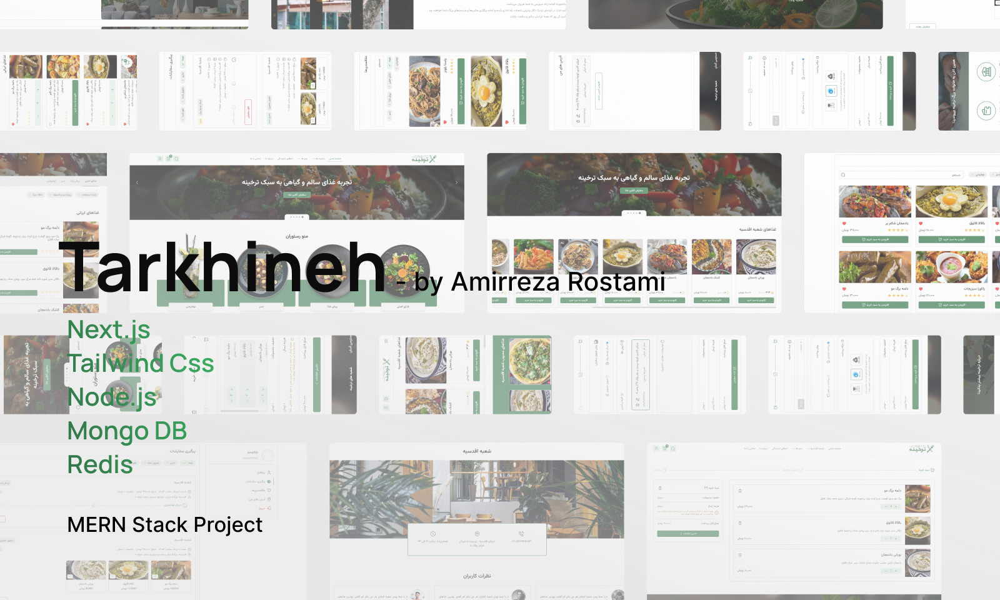
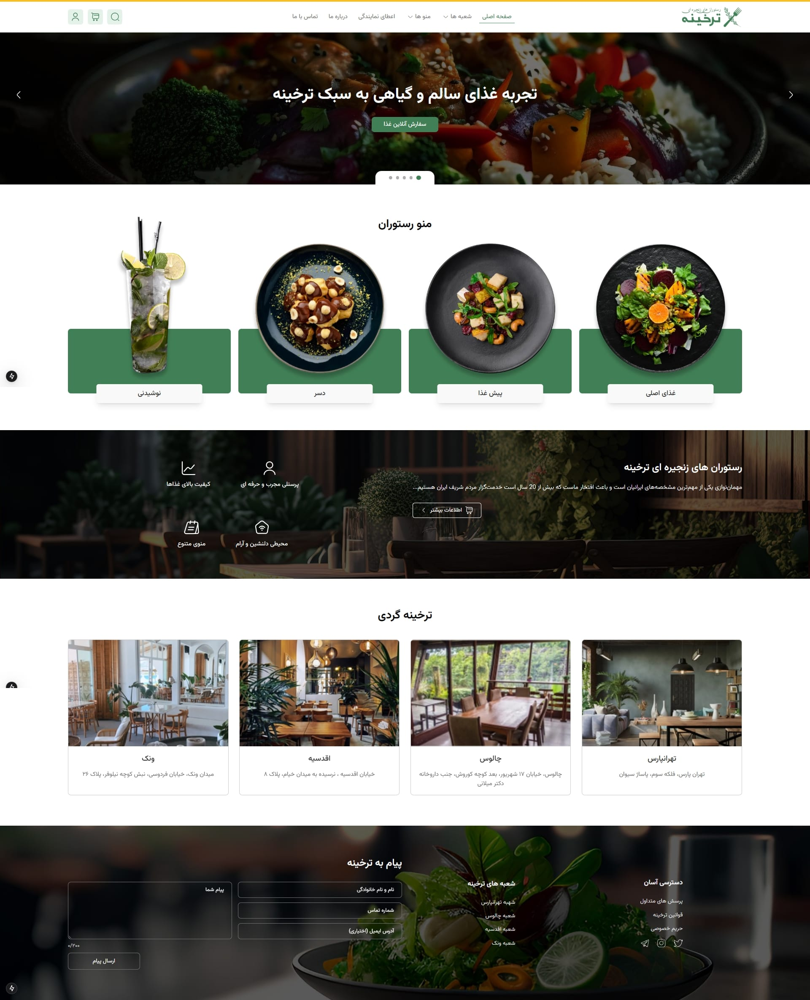

#  **Tarkhineh** — Multi-Branch Food Ordering & Reservation Platform

[](https://github.com/amirrezaRst/tarkhineh/stargazers)
[](https://github.com/amirrezaRst/tarkhineh/network/members)
<!-- Optional badges:
-->
[](./LICENSE)
[](https://github.com/amirrezaRst/tarkhineh)

### Portfolio project — actively maintained

---

## Table of Contents
1. [Overview](#overview)
2. [Highlights](#highlights)
3. [Key Features](#features)
4. [Roadmap](#roadmap)
5. [Tech Stack](#tech-stack)
6. [Screenshots](#screenshots)
7. [Installation](#installation)
8. [Environment Variables](#environment-variables)
9. [Demo Mode](#demo-mode)
10. [Database Seeding (Important)](#database-seeding)
11. [Testing](#testing)
12. [Project Structure](#project-structure)
13. [Security Notes](#security-notes)
14. [Contributing](#contributing)
15. [License](#license)
16. [Contact](#contact)

---

## Overview <a name="overview"></a>

**Tarkhineh** is a **multi-branch food ordering and reservation platform** for a chain restaurant with **4 branches**, supporting both **online and in-person** orders with **pickup** and **courier delivery**.

The system includes role-specific dashboards for:
- **Super Admin** (global management)
- **Branch Manager** (branch-scoped operations)
- **Branch Couriers** (delivery lifecycle)

A core focus of this project is enforcing **strict branch-scoped access control** across the system, and building it the way a real production codebase would be built — server-side price integrity, real automated tests, real caching, real request hardening — not just a UI mockup wired to a database.

> This is a **portfolio project**, built to demonstrate full-stack engineering practice — it is not a live commercial product and processes no real payments. See [Demo Mode](#demo-mode) for how to actually log in and explore it without a real SMS provider.

---

## Highlights <a name="highlights"></a>

- Built a **multi-branch architecture (4 branches)** with branch-scoped data isolation.
- Implemented the **order lifecycle**: in-person/online orders → preparation → pickup/delivery, with order status tracking.
- Implemented **RBAC + branch-scoped authorization** (a central role model plus owner/branch guards) to prevent unauthorized access to orders and admin actions.
- **Server-side price integrity**: order totals, per-item discounts, and coupons are recomputed on the server from the cart — client-supplied amounts are never trusted.
- Hardened backend security: **Helmet** secure headers, **rate limiting** (global + strict on OTP endpoints, backed by **Redis** so limits survive a restart), **NoSQL-injection sanitization**, Joi input validation, and JWT in **HttpOnly cookies** — with logout actually revoking the access token server-side, not just clearing the cookie.
- **Redis** backs response caching on the read-heavy endpoints (N+1-query branch/menu lookups, multi-aggregation admin/report endpoints), OTP storage, and a per-user lock that closes a real double-submit window in checkout.
- **Real SEO**: per-page metadata (dynamic per branch), a live sitemap.xml generated from the actual branch list, robots.txt, and a proper favicon/OG image/PWA manifest.
- **Automated tests**: Vitest (unit + integration, via Supertest against a real Express app) on the backend, Playwright E2E on the frontend — see [Testing](#testing).
- Integrated **Zarinpal payment gateway** for checkout.

> One originally-planned headline feature — a smart, location-based courier **dispatch** strategy — is **not yet implemented**; couriers are currently assigned manually. See [Roadmap](#roadmap).

---

## Key Features <a name="features"></a>

- ✅ Multi-branch ordering (4 branches) + branch-scoped data isolation
- 🔎 Search & filtering (menu / products)
- 🛒 Cart & Checkout flow, with a Redis lock preventing double-submit
- 💳 Zarinpal payment integration (server-side amount verification)
- 🔐 Authentication via **phone number + OTP**, JWT stored in **HttpOnly cookies**, real server-side logout revocation
- 🧭 Role-based route access (Super Admin / Branch Manager / Courier)
- 🧰 Full admin, branch manager, and courier dashboards
- ⚡ Redis-backed caching, rate limiting, and OTP storage
- 🗺️ Real SEO: per-page metadata, dynamic sitemap, robots.txt, OG image
- 🧪 Automated tests: Vitest (unit + integration) + Playwright (E2E)
- 🖥️ App-wide skeleton loading (shimmer, token-driven, respects `prefers-reduced-motion`)

---

## Roadmap <a name="roadmap"></a>

Planned / partially-built work, tracked honestly so the docs match the code:

- 🚚 **Smart courier dispatch** (assign orders to the nearest/least-loaded courier by geolocation) — couriers are currently assigned manually by branch staff; the courier model has no location field yet.
- 📱 **Real SMS delivery of OTP codes** — deliberately out of scope for a portfolio project with no real users; see [Demo Mode](#demo-mode) for how login actually works here instead.
- 📊 **Error monitoring / analytics** (e.g. Sentry) — not wired up; no real traffic to monitor yet.
- ⚙️ **CI** (tests running automatically on push) — the test suite exists (see [Testing](#testing)) but isn't yet wired into GitHub Actions.
- 🧪 **Broader test coverage** — current tests are a real but small slice (auth/token logic, one core route, one E2E flow); checkout/payment/coupon logic isn't covered yet.

---

## Tech Stack <a name="tech-stack"></a>

### Frontend
- **Next.js 15** (App Router)
- **React 19 (RC)**
- **Tailwind CSS**
- **Zustand**
- **React Hook Form**
- **React Toastify**
- **Playwright** (E2E tests)

### Backend
- **Node.js / Express.js**
- **MongoDB (Mongoose)**
- **Redis** — response caching, rate limiting, logout revocation, OTP storage, checkout idempotency lock
- **JWT Auth (HttpOnly Cookies)**
- **Joi Validation**
- **Helmet** (secure headers), **express-rate-limit**, **express-mongo-sanitize**
- **Multer + Sharp** (uploads & image processing)
- **node-cron** (scheduled jobs)
- **Zarinpal (Checkout/Pay)**
- **Vitest + Supertest** (unit + integration tests)

---

## Screenshots <a name="screenshots"></a>




<!-- 
> Live Demo: **TBA** (add your deployment link here) 
-->

---

## Installation <a name="installation"></a>

This repository contains two separate apps:

- `backend/` (Express + MongoDB)
- `frontend/` (Next.js 15)

### Prerequisites
- Node.js **>= 18** (recommended)
- MongoDB (local or Atlas)
- Redis (local or cloud) — optional, see [Security Notes](#security-notes); the app runs fine without it

### 1) Clone
```bash
git clone https://github.com/amirrezaRst/tarkhineh.git
cd tarkhineh
```

### 2) Backend Setup
```bash
cd backend
npm install
```

Create `backend/config/config.env` (see [Environment Variables](#environment-variables))

Run backend (dev):
```bash
npm run dev
```

Run backend (prod):
```bash
npm run start
```

Backend default:
- `http://localhost:5000`

### 3) Frontend Setup
```bash
cd ../frontend
npm install
```

Create `frontend/.env` (see [Environment Variables](#environment-variables))

Run frontend (dev):
```bash
npm run dev
```

Build frontend:
```bash
npm run build
```

Run frontend (prod):
```bash
npm run start
```

Frontend default:
- `http://localhost:3000`

---

## Environment Variables <a name="environment-variables"></a>

Templates are checked into the repo — copy them and fill in your values:

- Backend: copy `backend/config/config.env.example` → `backend/config/config.env`
- Frontend: copy `frontend/.env.example` → `frontend/.env`

### Backend: `backend/config/config.env`
These are the variables the code actually reads:

```env
PORT=5000
MONGO_URI="mongodb://localhost:27017/tarkhineh"

# Generate each with: node -e "console.log(require('crypto').randomBytes(48).toString('hex'))"
JWT_SECRET=your_access_secret
REFRESH_TOKEN_SECRET=your_refresh_secret

FRONT_ADDRESS="http://localhost:3000/"

# Comma-separated list of allowed CORS origins
CORS_ORIGINS=http://localhost:3000

# Zarinpal (sandbox test id: eaa46b01-819e-42ef-8a67-ba2bb7f69a32)
ZARINPAL_MERCHANT_ID=your_zarinpal_merchant_id
ZARINPAL_SANDBOX=true

# Optional — see below
REDIS_ENABLED=false
REDIS_URL=redis://localhost:6379
DEMO_MODE=false
```

### Frontend: `frontend/.env`
```env
NEXT_PUBLIC_API_URL=http://localhost:5000/api
NEXT_PUBLIC_IMAGE_URL=http://localhost:5000/public
NEXT_PUBLIC_BASE_URL=http://localhost:3000/
```

---

## Demo Mode <a name="demo-mode"></a>

No SMS provider is wired up (this is a portfolio project, not a real product), so registration would normally leave a visitor stuck at "code sent" with no way to receive it. Setting `DEMO_MODE=true` in `backend/config/config.env` fixes that: the generated OTP code is returned directly in the `/user/register` response, and the login modal shows it in a clearly-labeled banner instead of a toast that would disappear before anyone could read it.

This is off by default and meant only for a demo/showcase deployment — never turn it on for anything that has real users.

To see each role's dashboard with realistic pre-populated data rather than a blank new account, log in as one of the [seeded](#database-seeding) accounts instead of a fresh phone number:

| Role | Phone |
|---|---|
| Admin | `09120000001` |
| Branch Manager | `09120000011` |
| Courier | `09120000021` |
| Customer | `09120000999` |

---

## Database Seeding (Important) <a name="database-seeding"></a>

This project relies on MongoDB content (branches, menus, etc).  
If you run it with an empty MongoDB, the UI will show no items.

### Run seed (recommended)
```bash
cd backend
npm run seed -- --reset
```

- `--reset` clears existing documents in Tarkhineh collections first (recommended for local dev).
- Make sure `MONGO_URI` is set in `backend/config/config.env`.

### What it seeds
- ✅ 4 branches (each with a manager + menus)
- ✅ sample menus
- ✅ sample discount linked to a menu item
- ✅ sample coupon (`WELCOME10`)
- ✅ sample cart, order, payment
- ✅ sample like & review
- ✅ sample reports
- ✅ test users for different roles (admin / branch_manager / courier / user)

---

## Testing <a name="testing"></a>

```bash
# Backend — unit + integration (Vitest + Supertest)
cd backend
npm test          # single run
npm run test:watch

# Frontend — E2E (Playwright), needs both dev servers already running
cd frontend
npm run test:e2e
```

Backend integration tests hit a real Express app (`backend/app.js`, built without `.listen()` specifically so it can be imported in isolation) against the local MongoDB instance. E2E tests drive a real browser against the running app end to end — including a full register → demo OTP → login flow (see [Demo Mode](#demo-mode)).

---

## Project Structure <a name="project-structure"></a>

```txt
tarkhineh/
├─ frontend/
│  ├─ src/
│  │  ├─ app/
│  │  ├─ assets/
│  │  ├─ components/
│  │  ├─ constant/
│  │  ├─ hooks/
│  │  ├─ services/
│  │  ├─ stores/
│  │  └─ utils/
│  ├─ public/
└─ backend/
   ├─ config/
   ├─ controllers/
   ├─ middleware/
   ├─ models/
   ├─ public/
   ├─ routes/
   ├─ utils/
   ├─ validation/
   ├─ seed/
   └─ server.js
```

---

## Security Notes <a name="security-notes"></a>

- Authentication uses **JWT in HttpOnly cookies** (reduces XSS token theft risk compared to localStorage). Logout invalidates **both** the refresh token (in Mongo) and the still-valid access token (blocklisted in Redis by hash, TTL'd to its own remaining lifetime) — not just the client-side cookie.
- Authorization is enforced server-side via:
  - **RBAC** — a central role model with reusable `Authenticate` / `Authorize` middleware.
  - **Ownership** guards — users can only act on their own cart / orders / addresses / reviews (identity is taken from the session, never from the request body).
  - **Branch-scoped** guards — a manager/courier can only access their own branch's data.
- **Price integrity** — order totals, per-item discounts, and coupons are recomputed server-side from the cart; client-supplied amounts are ignored. A Redis lock on `createOrder` also closes a real double-submit window (a duplicate request could otherwise create two orders — and redeem a coupon twice — from the same cart).
- Backend hardening:
  - **Helmet** — secure HTTP headers (CSP, HSTS, `X-Content-Type-Options`, etc.).
  - **Rate limiting** — a global limiter plus a strict limiter on the OTP request/verify endpoints, backed by Redis so limits are shared/durable rather than reset on every restart.
  - **express-mongo-sanitize** — strips `$`/`.` operators from user input to block NoSQL injection.
  - **Joi** input validation on request bodies.
- Secrets (`config.env`) are git-ignored; `.env.example` templates are provided instead.
- Redis backs several of the above but is fully optional (`REDIS_ENABLED=false` is the default) — every feature that touches it falls back gracefully (in-memory rate limiting, no caching, no revocation check) rather than becoming a hard dependency.

---

## Contributing <a name="contributing"></a>

Contributions are welcome.

Suggested workflow (you can formalize this in `CONTRIBUTING.md`):
1. Fork the repo
2. Create a feature branch: `feat/<short-name>`
3. Run lint before PR (frontend): `npm run lint`
4. Submit a PR with a clear description and screenshots if UI-related

> Tip: Add `CONTRIBUTING.md` + PR/Issue templates for a more professional open-source experience.

---

## License <a name="license"></a>

This project is licensed under the **MIT License** — see `LICENSE`.

---

## Contact <a name="contact"></a>

- 📧 Email: [amirreza.rostami.0073@gmail.com](mailto:amirreza.rostami.0073@gmail.com)
- 🌐 Website: [https://arostami.dev/en](https://arostami.dev/en)
- 💼 LinkedIn: [LinkedIn Profile Address](https://www.linkedin.com/in/amirreza--rostami/)
